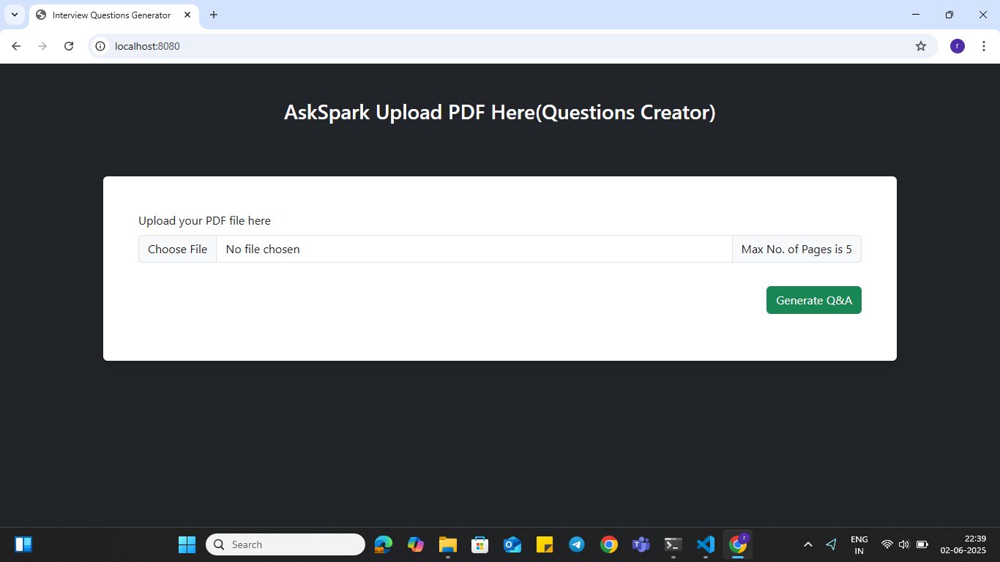
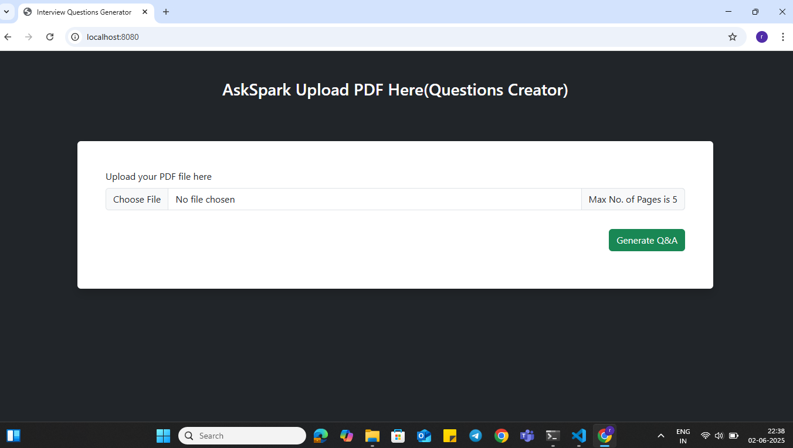
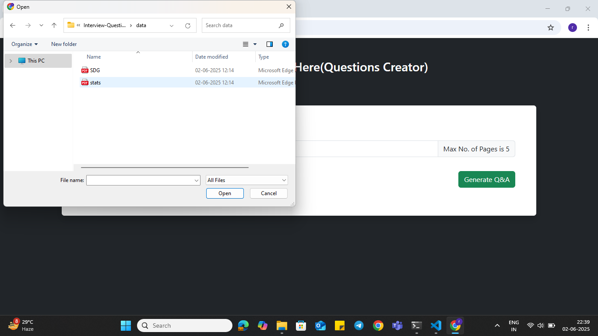
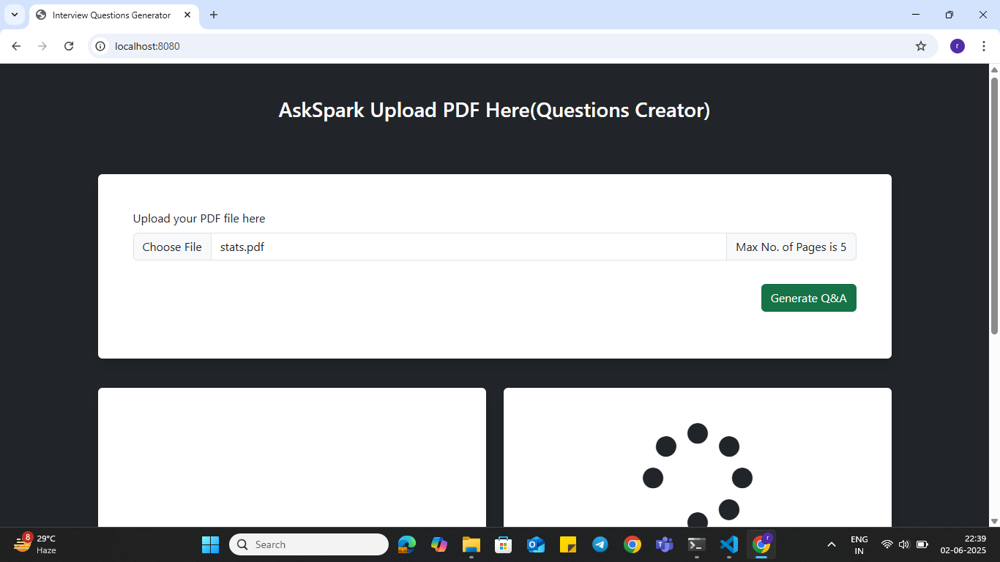
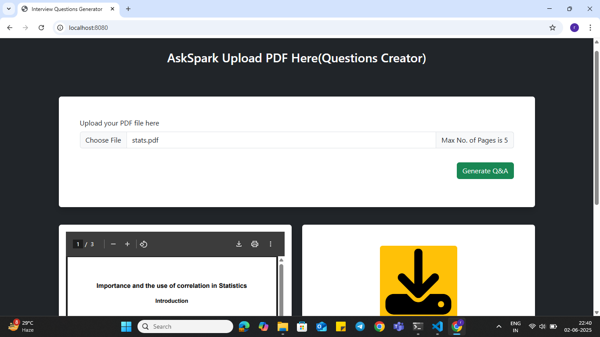
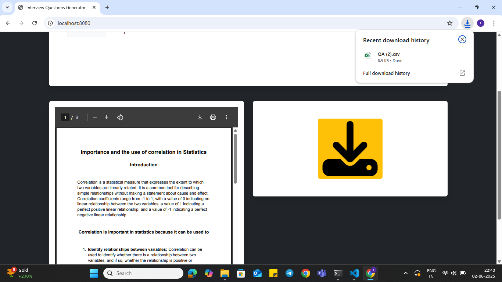
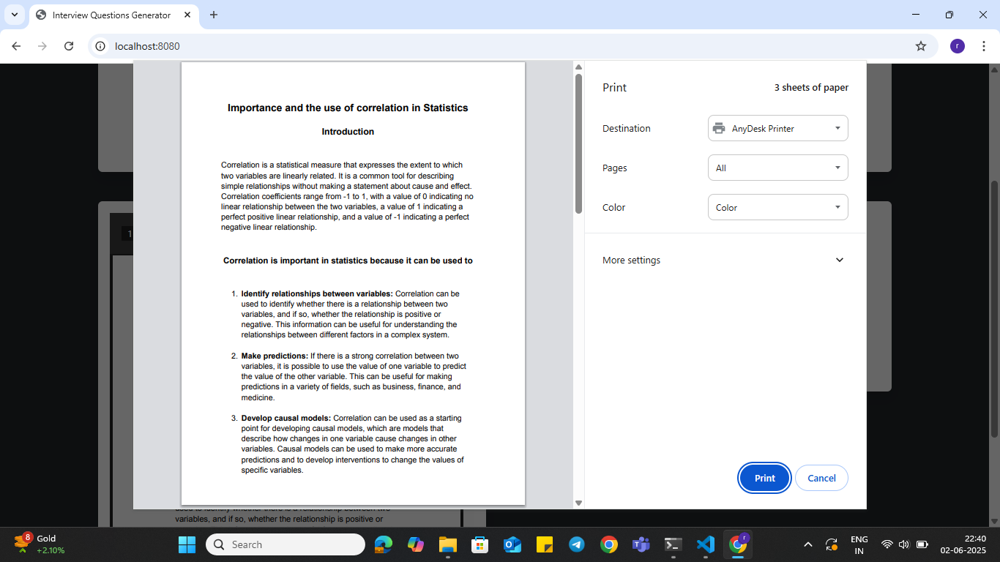
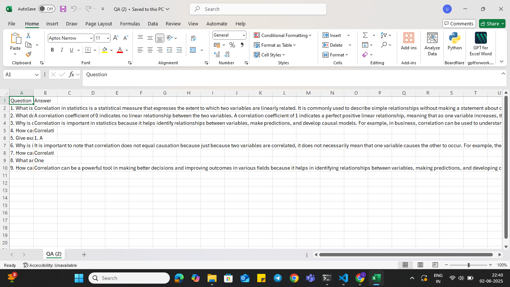

# Interview-Question-Creator


## How to run:

1. Create an environment

```bash
conda create -n interview python=3.10 -y


conda activate interview

```

2. Activate the environment

```bash
conda activate interview
```


2. install requirements

```bash
pip install -r requirements.txt
```


### GitHub commands

```bash
1. git clone https://github.com/

2. git add .

3. git commit -m "readme updated"

4. git push origin main

```


## 📂 Project Structure

## 📱 App Preview








